<!-- .slide: data-background="#363636" -->

## Hard Drive Tables

---

# 👨🏼‍💻
## David Beitey
### (@davidjb)
## 🧢🎩👒🎓🤠 

Notes:
* Wear lots of tech hats

---

## MBR!
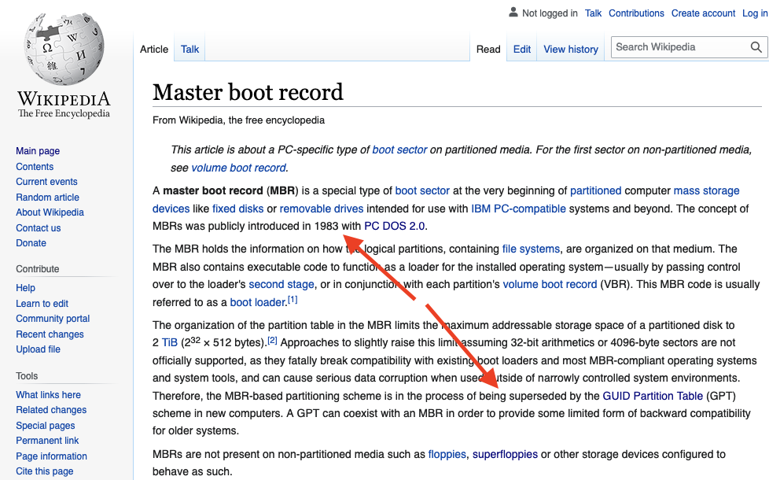 <!-- .element class="plain stretch" style="max-height: 60vh;" -->

Notes:
* When it comes to HDD "Tables"... there's
* MBR: and its incredible 38 year history

---

## GPT!!

BIOS Boot Partition GUID (invalid):

`21686148-6449-6e6f-744e656564454649`

## ⬇

`!haH-dI-no-tNeedEFI`

## ⬇  <span style="font-size: 25%;">(mixed-endian format)</span>

`Hah!IdontNeedEFI`

Notes:
* GUID Partition Table
* GPT: and GRUB's fun easter egg; legacy BIOS partition's invalid GUID

---

<!-- .slide: data-background="#000" data-auto-animate -->

```sh
error: no such partition.
Entering talk rescue mode...
grub rescue>
```
<!-- .element: data-id="uhoh" -->

Notes:
* Talk's HDD crashed

---

<!-- .slide: data-background="#000" data-auto-animate -->

```sh
error: no such partition.
Entering talk rescue mode...
grub rescue> boot actual talk
```
<!-- .element: data-id="uhoh" -->

Notes:
* Could talk about the endian-ness of GUIDs & humour of the GRUB authors all
  night long
* But I'm gonna talk about _this_ instead

---

<!-- .slide: data-background="#000" data-background-image="img/ewaste.jpg" data-background-opacity="0.4" data-transition="fade" -->

# E-Waste

<p style="width: 50%; margin: 0 auto 3rem; border-top: 2px solid #fff;"><!-- --></p>

<p style="font-size: 40%;">
  Source: <a href="https://www.flickr.com/photos/techbirmingham/345897594/">https://www.flickr.com/photos/techbirmingham/345897594/</a>
</p>

Notes:
* **01:00 or 4 MINS TO GO**

---

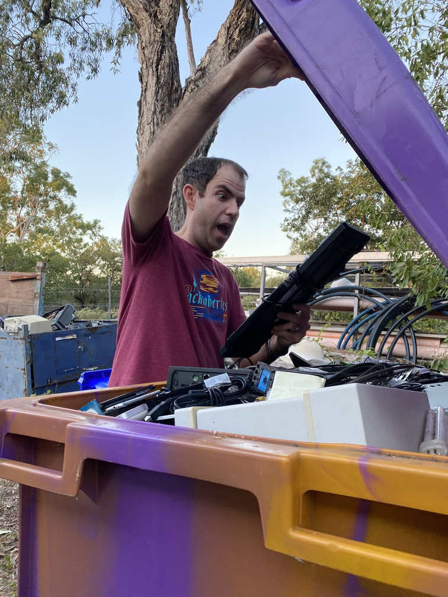 <!-- .element class="plain stretch" style="max-height: 80vh;" -->

Notes:
* Something I get excited about

---

## Large Org<br>=<br>Lots of e-waste

Notes:
* TBF, where I work is pretty good - most stuff doesn't end up in the bin
* But in 2 years, I've recovered ~$14k of items
* Accidents, laziness, non-technical dumpers; people unaware
* **Perceived trash is my treasure**

---

<!-- .slide: data-background="#000" data-background-image="img/ewaste-guiyu-china.jpg" data-background-opacity=".7" data-transition="fade" -->

<p style="font-size: 40%;">
  Source: <a style="color: #fff; text-decoration:underline;" href="https://www.flickr.com/photos/basel-action-network/9263401532">https://www.flickr.com/photos/basel-action-network/9263401532</a>
</p>

<p style="width: 50%; margin: 2rem auto 75vh; border-top: 2px solid #fff;"><!-- --></p>

Notes:
* 100k migrant workers in China break down imported computers
* Dangerous, hazardous materials
* Plenty more horrifying stories of melting boards for precious metals
* Human + Environmental effects are epic

---

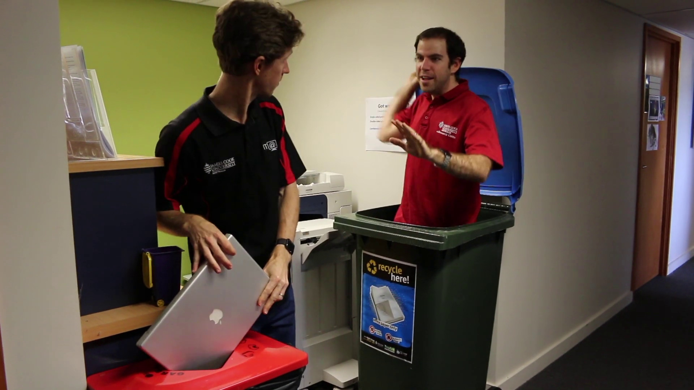 <!-- .element class="plain stretch" style="max-height: 40vh; margin: 0;" -->
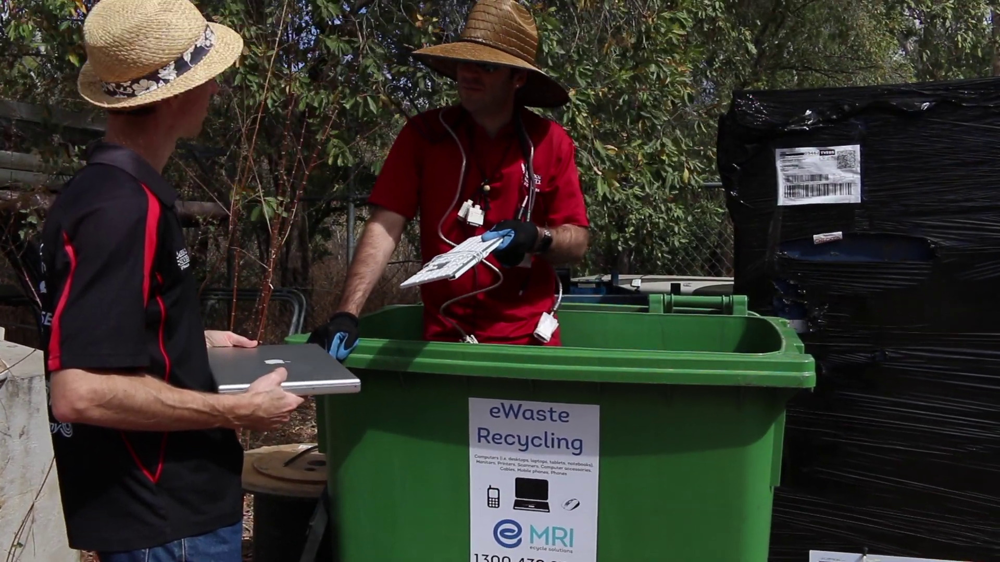 <!-- .element class="plain stretch" style="max-height: 40vh; margin: 0;" -->

Search "[JCU OIC](https://www.youtube.com/watch?v=9JLb91c4Lww)" on YouTube...

Notes:
* What can _WE_ as tech do??
* Go watch this video on sustainability
* Thanks to Lindsay Ward for co-starring
* Spoiler Alert: I jump out of bins

---

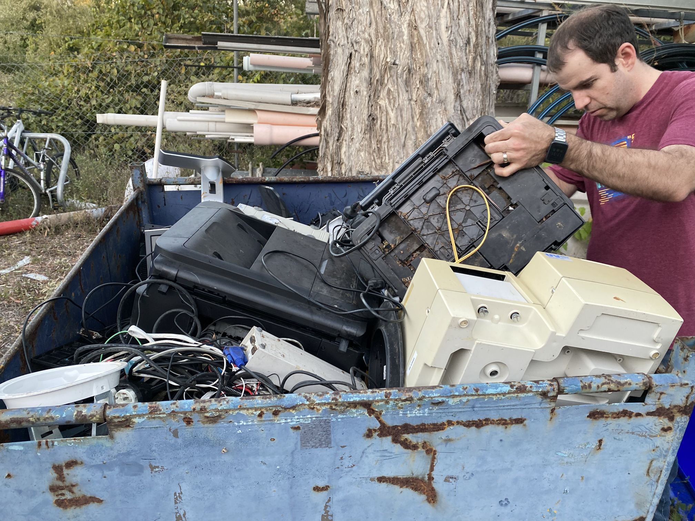 <!-- .element class="plain stretch" style="max-height: 80vh;" -->

Notes:
* Keyboards, mice, cables by the hundred
* Monitors, TVs, Phones
* Computers and parts...

---

<!-- .slide: data-background="#363636" data-transition="fade" -->

Notes:
* Show HDD
* 3.5 inches, solid and cool
* But what to do with them?

---

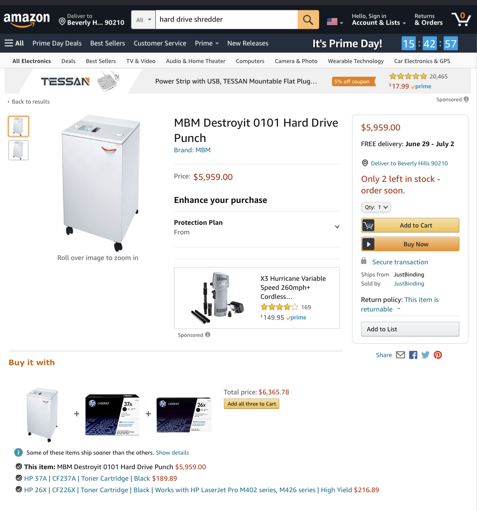 <!-- .element class="plain stretch" style="max-height: 80vh;" -->

Notes:
* Could get this awesomely named shredder on Prime Day free shipping from the
  US, but
* Doesn't solve the waste problem

---

# 💡

---

<!-- .slide: data-background="#000" data-transition="fade" -->

# Da-ta! 🎉

* 22 x 3.5-inch HDDs
* ~6TB
* 12 kg (without glass)

Notes:
* Table reveal - data!
* 1.5 tubes of liquid nails

---

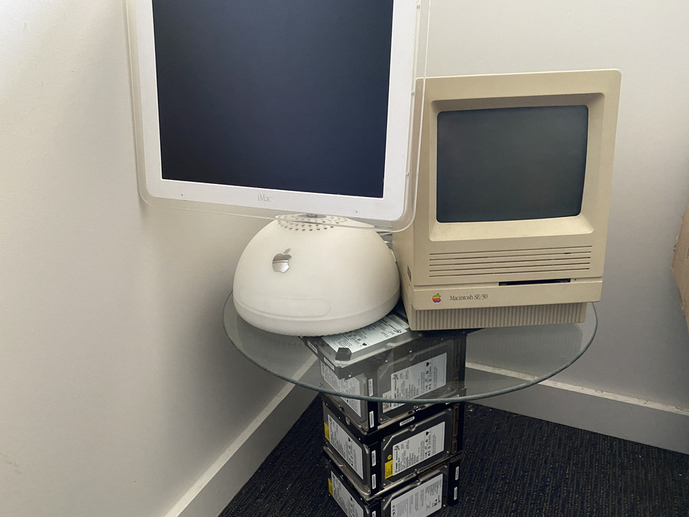 <!-- .element class="plain stretch" style="max-height: 45vh;" -->
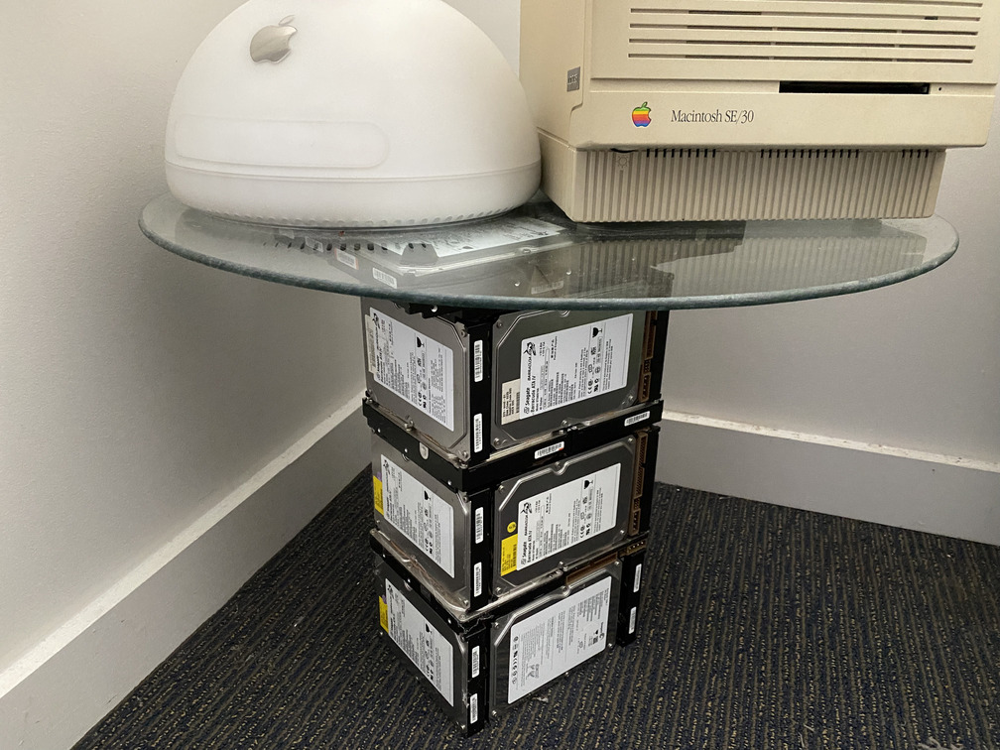 <!-- .element class="plain stretch" style="max-height: 45vh;" -->

Notes:
* First HDD can't be here tonight – it's "in production"
* Old server cluster: identical 40GB drives, perfect
* Considered other designs but this is light to carry (12kg) and
  sturdy/large enough to stay upright & hold weight

  * Original plans were 108 drives / 65kg @ 600g each: NO!

* Stick w/ Liquid nails!
* Rubber stoppers on top to hold the glass
* Glass from 2nd hand store
* Total bill: ~$10
* And maybe it's not as cool as...

---

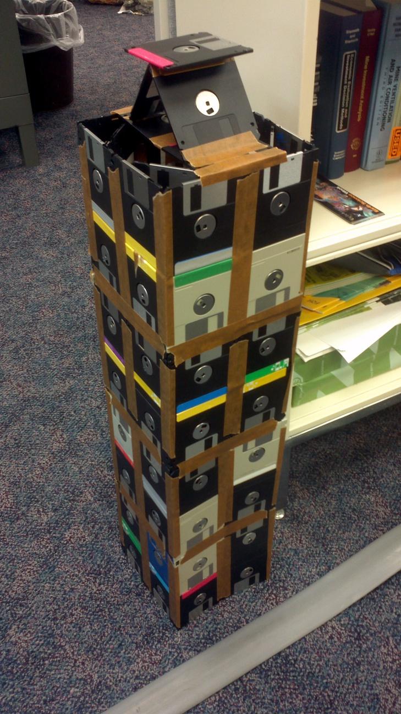 <!-- .element class="plain stretch" style="max-height: 80vh;" -->

<https://dcstructural.com/> <!-- .element style="font-size: 50%;" -->

Notes:
* Floppy Disk Skyscraper

---

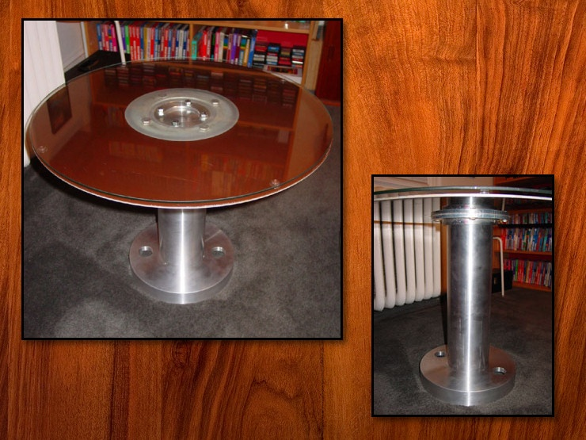 <!-- .element class="plain stretch" style="height: 80vh;" -->

http://www.grandideastudio.com/hard-drive-coffee-table/ <!-- .element style="font-size: 50%;" -->

Notes:
* HDD Coffee table - platter from 1960s

---

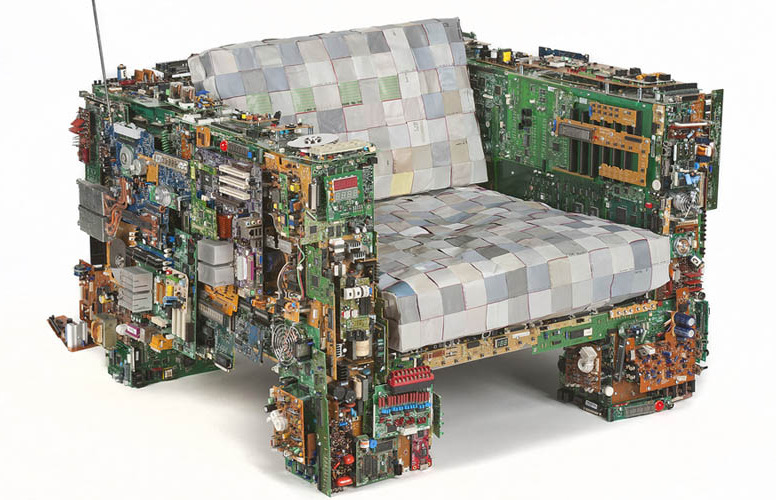 <!-- .element class="plain stretch" style="max-height: 60vh;" -->

https://www.decoist.com/2015-04-08/recycled-chairs-eco-chic-designs/ <!-- .element style="font-size: 50%;" -->

Notes:
* Binary chair

---

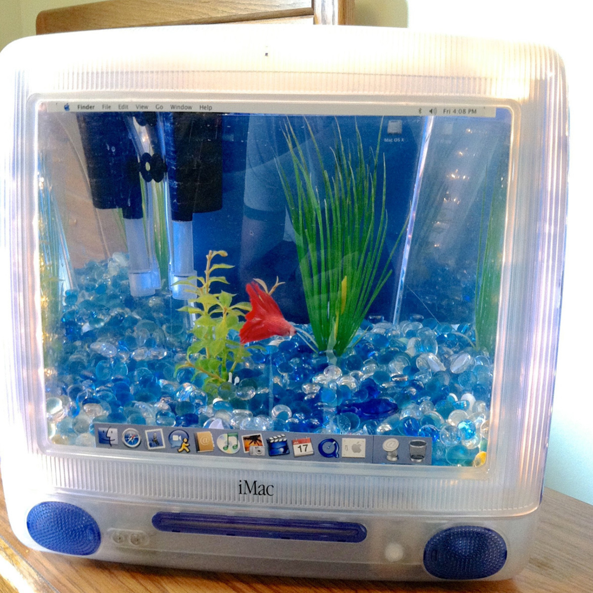 <!-- .element class="plain stretch" style="max-height: 80vh;" -->

https://coolhunting.com/buy/imac-aquarium/ <!-- .element style="font-size: 50%;" -->

Notes:
* iMac Aquarium

---

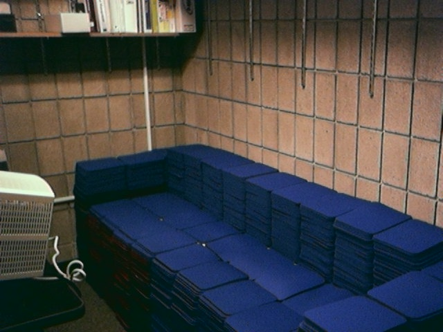 <!-- .element class="plain stretch" style="max-height: 40vh; margin: 0;" -->
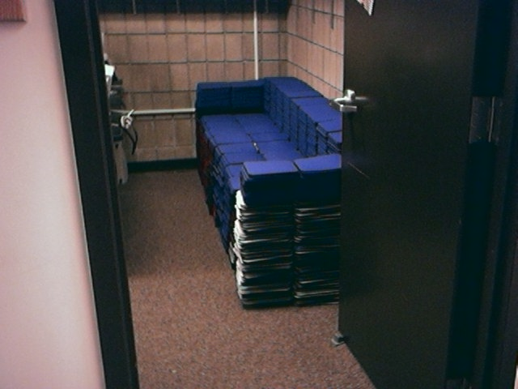 <!-- .element class="plain stretch" style="max-height: 40vh; margin: 0;" -->

https://web.archive.org/web/20040803073545/http://www.rit.edu/~jpsdss/couch/ <!-- .element style="font-size: 50%;" -->

Notes:
* Mousepad couch

---

### DIY

1. Get materials and HDDs
1. Align + glue each layer carefully
1. **Wait til each dries**
1. Add rubber stoppers on top + glass
1. ...?
1. Do a lightning talk about it

Notes:
* **1 MIN TO GO**
* As I build more, they're getting fancier
* WD's colour range - failed red 3TB drives now...

---

1. ### Reduce
1. ### Reuse
1. ### _Upcycle_
1. ### Recycle

Notes:
* Average Australian creates 23kg of ewaste a year - this is 12kg alone
* What could you make / save from ?

---

### Free E-waste Recycling

* [Officeworks](https://www.officeworks.com.au/information/about-us/sustainability/environment/recycling) (➡ MRI)
* [MRI DropZones](https://mri.com.au/dropzone/)
* [Townsville City Council Transfer Stations](https://www.townsville.qld.gov.au/water-waste-and-environment/waste-and-recycling/waste-facilities)
* ...?

Notes:
* But worth noting that War on Waste highlighted some key issues
* Devices end up in Asia, possibly in waste dumps and the environment

---

<!-- .slide: data-background="#000" data-background-image="img/lurking.jpg" data-background-opacity=".7" data-transition="fade" -->

### Or...
## Give me your HDDs

Secure wiping guaranteed if still working

<p style="width: 50%; margin: 1rem auto; border-top: 2px solid #fff;"><!-- --></p>

👨‍💻 ❤️ 📜🍏

Notes:
* Wishlist: old Macs and especially ancient Macs (keyboard/mouse for my Mac SE)
* Get in touch!

---

<!-- .slide: data-background="#363636" data-transition="fade" -->

### Questions? <!-- .element: style="color: #fff" -->

<br>

# 👨‍💻

David Beitey <!-- .element: style="color: #fff" -->
<br>
<all.ur.drives@davidjb.com> <!-- .element: style="color: #fff; text-decoration: underline;" -->

---

### [More iMac aquariums](https://duckduckgo.com/?q=imac+aquariums&iax=images&ia=images)
